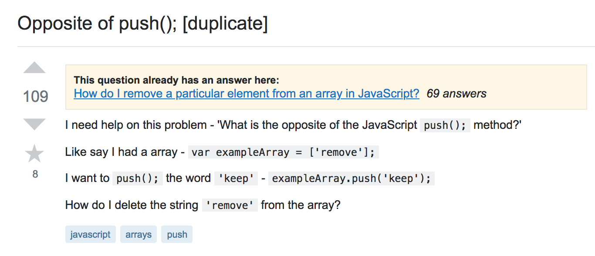

Growing up, we have always been encouraged to ask questions. Teachers have always said, “There are no dumb questions.” However, Eric Steven Raymond, the author of How to Ask Questions the Smart Way, would beg to differ. His essay explains what smart questions are and how, when, and where to ask them. 

## Why?
Why should we learn how to ask smart questions? Why are they important? Why should I read the rest of this page? Knowing how to ask smart questions is an invaluable skill, not just for software engineers, but for people in all walks of life. Asking smart questions increases your chances of obtaining the information that you are searching for in a reduced amount of time. 

## What are smart questions?
Smart questions are precise, succinct, and show that the inquirer has previously researched the topic and has made attempts to solve the problem. The inquisitor should also take steps to state the question as clearly as possible to make it easier for someone to read and reply to. This includes utilizing correct spelling and grammar, clearly formatting any snippets of code, and trimming irrelevant code. Smart questions should also explicitly ask an actual question instead of simply stating that “X does not work.” The question should also be posted in the appropriate forum to avoid being overlooked. Many posts are either ignored or presented with unamiable sarcastic replies when asked in the wrong forum. While keeping these guidelines in mind, let’s look at some examples from StackOverflow. 

## [Dumb Question Example](https://stackoverflow.com/questions/25517633/opposite-of-push?noredirect=1&lq=1)

  

This is an example of how not to ask questions. First of all, the inquirer obviously did not make any attempts to search for the solution himself. Simply typing in the subject header would have yielded several resources that thoroughly explain push, pop, shift, and unshift. Secondly, the subject header and the question in the body paragraph ask different questions, which is pointed out by the replies. Finally, there is no indication that Javascript is the language being used, except for the mention of var in the example code and in the tags. The replies also pointed out that there were discrepancies between the subject header and body, which caused confusion over what was the desired answer. 

## [Smart Question Example](https://stackoverflow.com/questions/153724/how-to-round-a-number-to-n-decimal-places-in-java?rq=1)

  

Now let’s move on to an example of a smart question. The subject header clearly and explicitly states the question in a way that is easy to understand. The body of the post goes into greater detail of the intended end goal. The inquirer also demonstrated that they have already done some previous research and properly formatted any example code. Asking questions the smart way leads to effective and efficient answers, as demonstrated by the quality of the replies to this question. 

## Insights
After analyzing several questions posted on StackOverflow, I have learned that carefully choosing your words with the reader in mind will significantly increase your chances of receiving your desired answer. Trimming and simplifying your code to make it more presentable and appealing will increase your chances of attracting potential solutions to your question. Posts that demonstrated that the inquirer has done some research and has made attempts to solve their problem before asking the question are less likely to be ignored. I also noticed that the posts that received the most informative and helpful replies were often questions that followed the guidelines for asking smart questions. 

