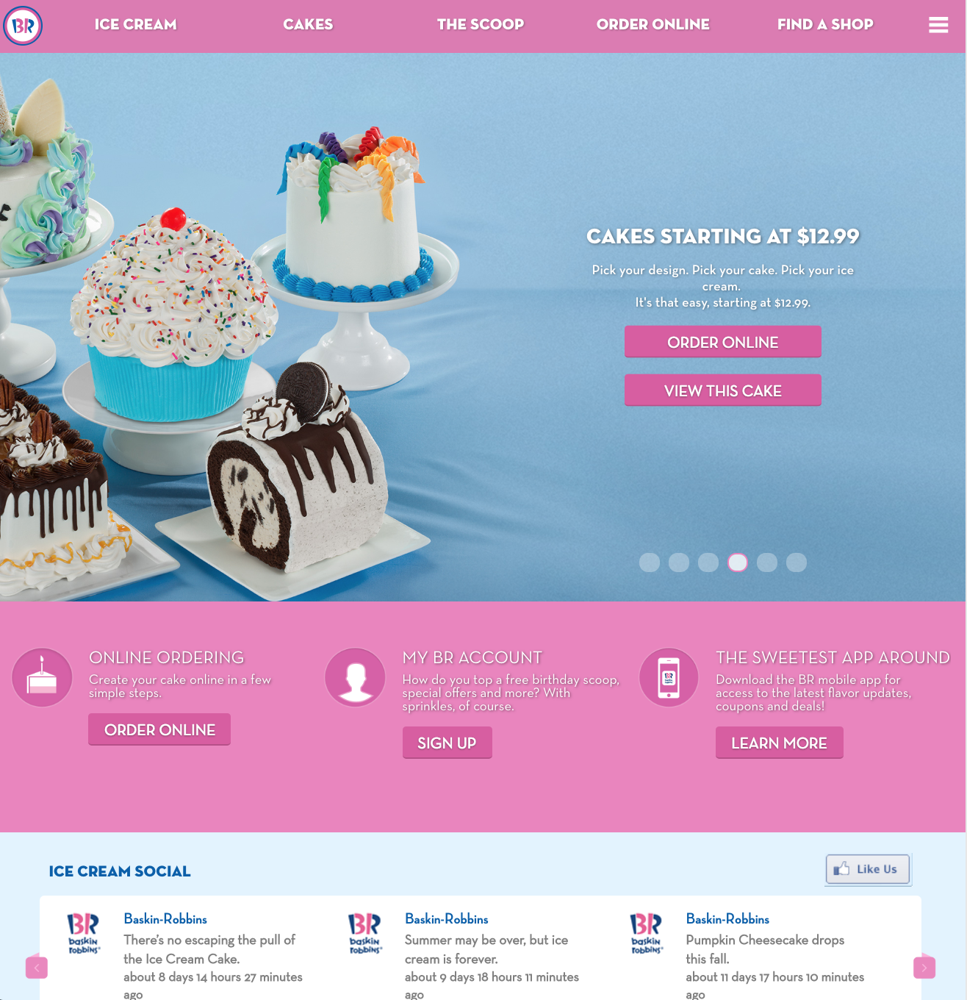
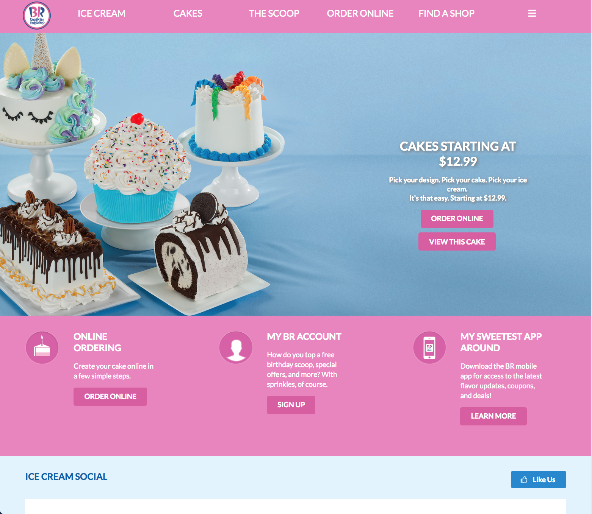

## Initial Impression
When I used a UI Framework for the first time, I was amazed at how quickly I could create a decent looking site, even though I was still a beginner. I will never go back to using raw HTML and CSS. Although both UI Frameworks and raw HTML and CSS are tedious to work with, UI Frameworks allow you to create more modern looking sites in a drastically reduced amount of time compared to HTML/CSS. I learned the basics of [Semantic UI](https://semantic-ui.com/) through an online course on [PluralSight](https://www.pluralsight.com/). It was very confusing at first, with all the different types, variations, and states for each element, and I still get confused between all of the different classes. However, this temporary frustration is just the initial stage of the process of learning pretty much anything, whether it’s an academic subject, an art, a sport, or a new language, which is similar to learning Semantic UI. It’s not exactly the same because it isn’t a stand-alone language, it just adds to the HTML through classes. However, learning when and where to put the UI classes is similar to learning the grammar of a language. Some classes won’t work the way you want it to if the words are out of order or in the wrong div. 

## Frustrating Frameworks
UI Frameworks, as the name implies, are like a frame. They do a lot of the work and formatting for you and provide you with some structure and stability, however, they can also act as cages that enclose and restrict you. For example, as I was replicating an existing site for an assignment, I wanted to have an image on the left and a column of text on the right. I used a grid to make three columns and put a two column grid in each of those columns. I then filled the columns with their respective information, however, there was a lot of negative space between each of the columns. I tried various methods to reduce the gap, including searching the grid class in Semantic UI and trying different variations, attempting to manually set the column widths, and experimenting with the padding and margins of the grid and columns. However, none of these methods worked. I had high hopes for the adjusting the padding for the columns, but apparently, padding is an invalid property value for ui columns. I even tried applying the “fitted” class that works with menus, but it wouldn’t apply any changes because that class is not associated with grids. There was a “relaxed grid” class that increased the gutter size or negative space between the columns, but there was no option to decrease the gutter size. I even searched on Google, and other people had similar problems but were unable to find a solution. In my opinion, there should be a way to manually adjust the gutter size, as this would give the users more flexibility to bring their designs to life. Although I was not satisfied with the result, but there wasn’t much more that I could do, so I decided to leave the columns as they were and move on. If you are interested (or even if you’re not, you’re going to see it anyway), a screenshot of the final product is shown below. I was attempting to replicate the layout of a section from the [Baskin-Robbins](https://www.baskinrobbins.com/content/baskinrobbins/en.html) website, also shown below. 

Original:

  

My Attempt: 

  

If you are interested, this is the final result showing the whole site.

  

    Original: 
    

      
    

  

  

    My Attempt: 
    

      
    

  

## Final Thoughts 
Although I had a lot of problems and spent hours staring at my screen trying to move objects around and get all the sizing and formatting correct, I can honestly say that I enjoyed learning about UI Frameworks and using Semantic UI. You may have to initially invest some time to learn the basics and all of the different types of elements and variations, but I would say that it is well worth it. Once you have a basic understanding of all the elements and collections, it can drastically reduce the amount of time it takes to create a beautiful and modern looking site. 

