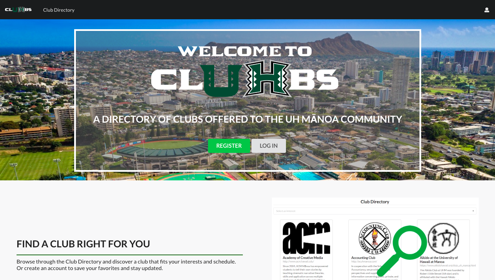
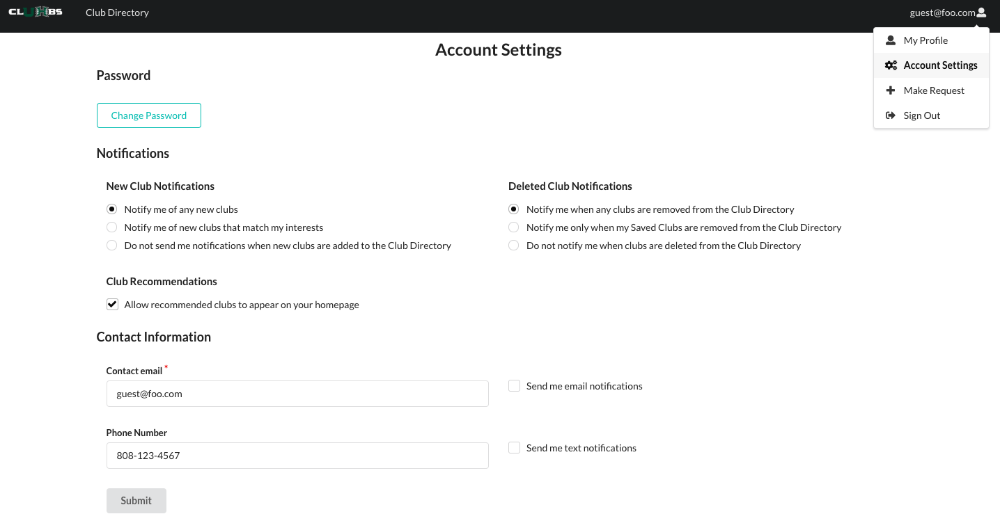
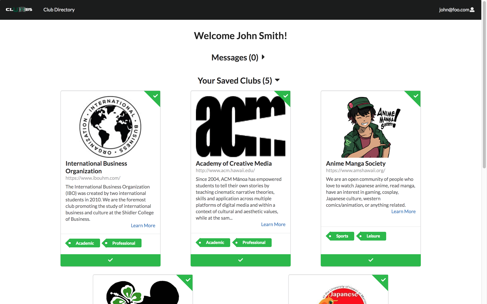
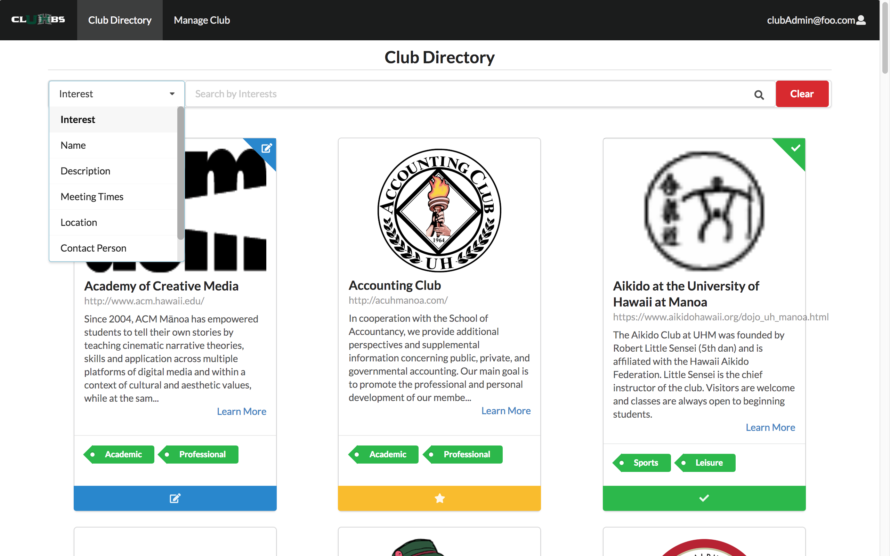
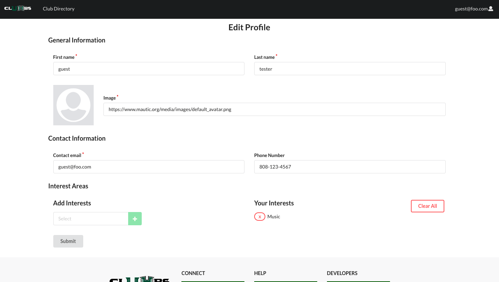
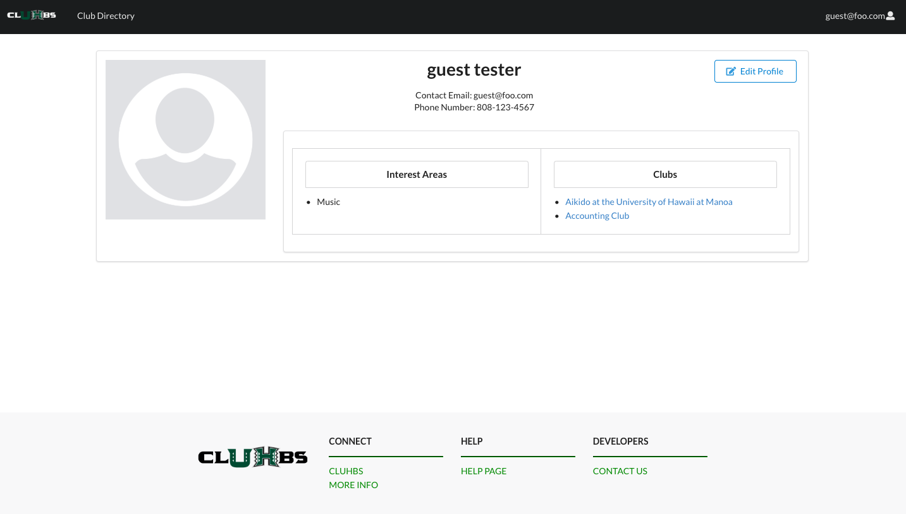
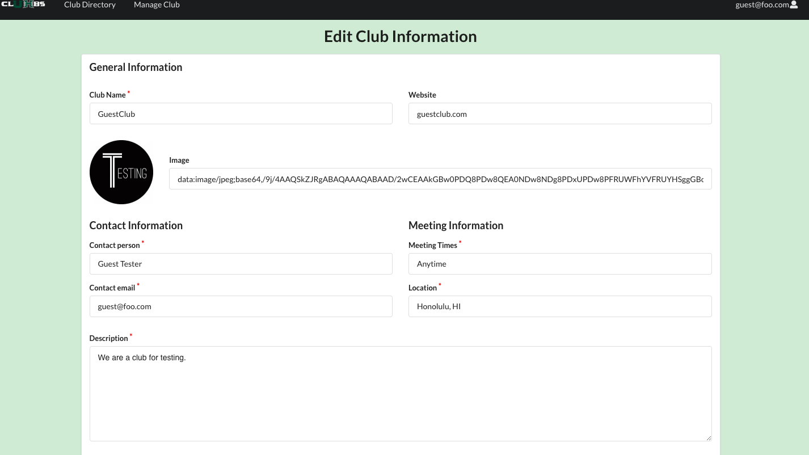
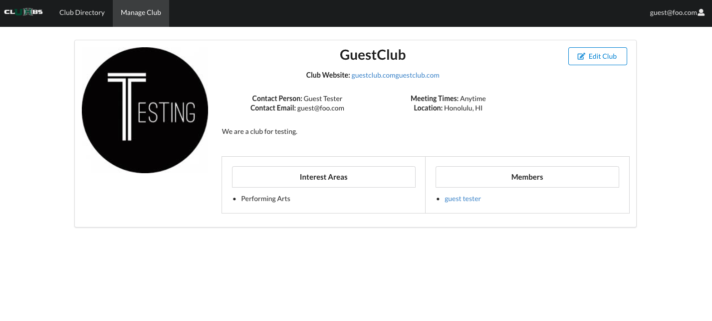
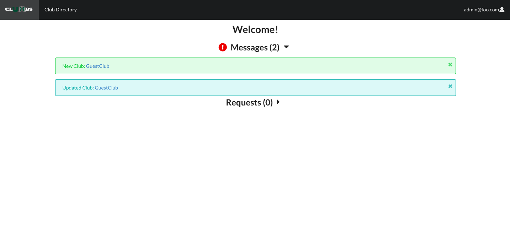
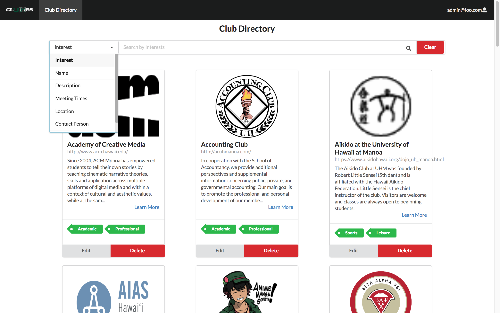

### Summary
[clUHbs](https://cluhbs.meteorapp.com/#/) is an application that I developed with Kylie Lin, Leisha Soberano-Keawemauhili, and Keanu Williams for our ICS 314 Final Project. It provides a centralized club directory of UH Manoa student clubs. But that's not all, it also provides several additional features to enhance the user's experience. In addition to the basic Club Directory, there is a search bar that allows the users to search by different categories, such as interest areas or name. If the user is logged in, they can save clubs to have them easily accessible on their homepage. They can create and edit their profile and receive club recommendations based on their interests. Notifications for new, deleted, and updated clubs are sent out to subscribed users. Users can change their password, notifications settings, and more on the Account Settings page.

### clUHbs Roles
All users, even without logging in, can view the Club Directory, where all clubs that are currently in the system are listed along with their basic information, such as name, description, website and interest areas. There is also a search bar at the top of the page that allows users to search for clubs by different categories. 

There are three types of user accounts or "roles". The first is a regular user, who can create and edit their profile and add their own interests, which are what their Club Recommendations are based on. They can also save clubs from the Club Directory to easily access them from their homepage. Lastly, they can make a request to become a Club Admin to add their club to the Club Directory. 

The second role is Club Admins, who are similar to regular users except instead of the option to make a request, they can add and manage their club. However, only Admins can delete their club. They can also create and edit their profile and save clubs from the Club Directory. 

The final role is Admins, who can accept and deny any request to become Club Admins, and edit or delete all clubs from the Club Directory. All users with an account will receive messages on their homepage when a club is created or deleted, but only Admins are notified when club information is edited. They can customize their notification settings and change their password in the "Account Settings" tab in the dropdown. They also have the option to send email or text notifications, however, we were unable to finish implementing this feature in time.

### My Observations
Some features/pages that I personally developed on: 
* Create, Edit, and Display Profile
* Create, Edit, and Display Club
* Save, Edit, and Delete Club Functions
* Club Directory Search Bar 
* Messages/Notifications for New, Deleted, and Updated clubs
* Recommended Clubs based on User's Interest Areas
* Account Settings
* Change Password Functionality

As I was working on the project I noticed that several functions and pages are very similar to each other. For example, I made the [Create and Edit Profile](https://github.com/cluhbs/cluhbs/blob/master/app/imports/ui/pages/EditProfile.jsx) pages link to the same file, so I didn't have to make the same edit twice whenever I edited the layout or fields. I did something similar for the [Create and Edit Club](https://github.com/cluhbs/cluhbs/blob/master/app/imports/ui/pages/EditClub.jsx) pages. However, since one of my team members worked on the Create Club page, the implementation is slightly different. Actually, to create the Edit and Display Club pages, I used the Profile versions of each page as the base and made the necessary changes. I believe that this style allows the pages and the overall site to have a more uniform appearance with minimal edits, but this could be a terrible idea that violates almost all of the coding standards and conventions. Also, the code for sending new and updated club notifications was very similar. While implementing the [Club Directory Search Bar](https://github.com/cluhbs/cluhbs/blob/master/app/imports/ui/pages/ClubDirectory.jsx), I also found quite a few similarities. In fact, every category except for the Interests category was implemented using the same code. After I figured out how to filter by name, I just needed to add one line of code for each of the other categories because they were all string based searches. This revelation was probably the happiest schoolwork has ever made me. 

### My Final Thoughts on My Final Project
Although working on this project was extremely frustrating at times, I can honestly say that I had fun working on it. It was very rewarding and satisfying when something actually worked correctly, especially when it took hours or even days to figure out. I didn't find this project tedious or impractical like several other projects or homework assignments; I actually learned quite a bit that will probably be useful in the future. I even got a little obsessed at one point, and I ended up doing tasks that weren't assigned to me. Especially toward the end of the project, when I could actually finish tasks in a reasonable amount of time, I added a few extra features that were completely unnecessary, but I just couldn't help myself.

If you haven't already, check out our app: [clUHbs](https://cluhbs.meteorapp.com).

For more information, visit the [clUHbs homepage](https://cluhbs.github.io/).

View the [source code](https://github.com/cluhbs/cluhbs).
