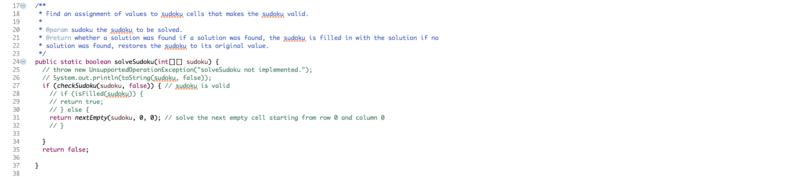
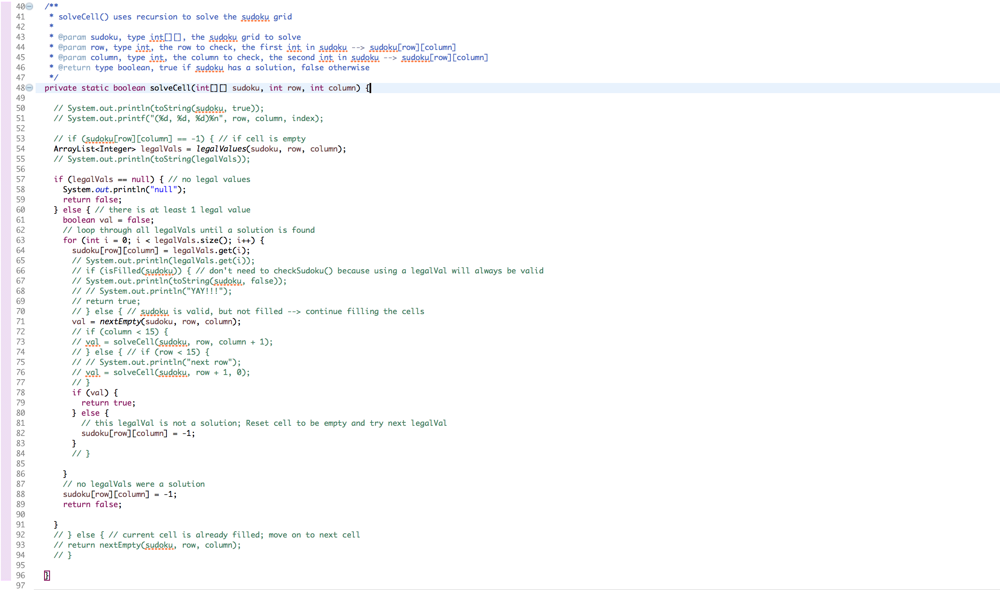
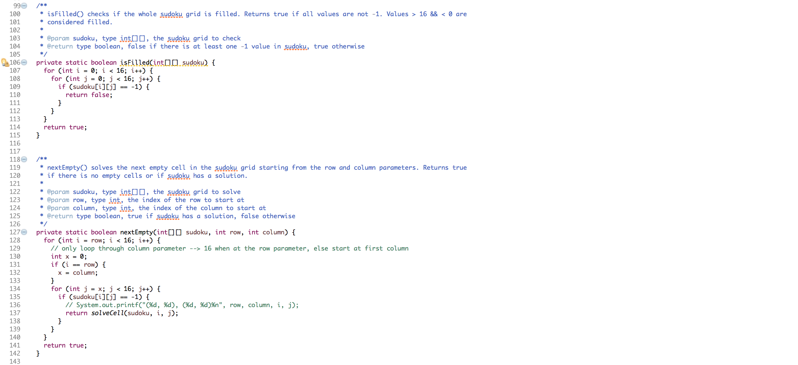

<details>
  <summary>Hexadecimal Sudoku Code Screenshots</summary>
    <div class="ui center aligned fluid container">
      <div class="ui rounded images">
        
        
        
      </div>
    </div>
</details>

### Summary
This project was a homework assignment for my ICS 211 class. Dr. Moore, my professor for this class, provided the code for formatting and setting up the sudoku grid and created restrictions to prevent illegal values. This is a program written in Java that solves 16x16 sudoku grids. For the puzzle to be considered solved, each row, column, and 4x4 grid must only contain one of each number (1-9) and letter (A-F). 

### Methods Explained
The solveSudoku() method takes one ```int[][]```, which represents the unsolved sudoku grid, as the parameter. This solveSudoku() method only checks if the grid is valid, and recursively calls the nextEmpty() and solveCell() methods to eventually solve the whole grid. The nextEmpty() method finds the next empty cell and calls solveCell() to solve it. The solveCell() method solves the cell and calls the nextEmpty() method to find and solve the next cell. These methods recurse until the grid is filled. The program uses a brute force approach by trying all of the possible solutions and backtracking when contradictions arise. 

### Lessons Learned
This project helped me to better understand and visualize recursion, while also introducing me to new concepts, such as backtracking. As I was working on the assignment I noticed that there was a lot of redundant code. The screenshots of my code above includes all of the lines of code that I commented out to improve the runtime of my program. Before making these changes, it would take about 5-10 minutes to run the entire program and check if the solutions were valid. However, after optimizing the code, the program only took a few seconds to run.

View the [source code](https://github.com/kathleen808/hexadecimal-sudoku). 
