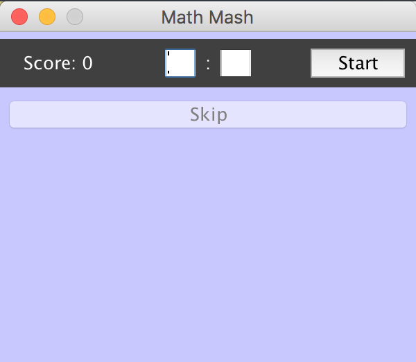
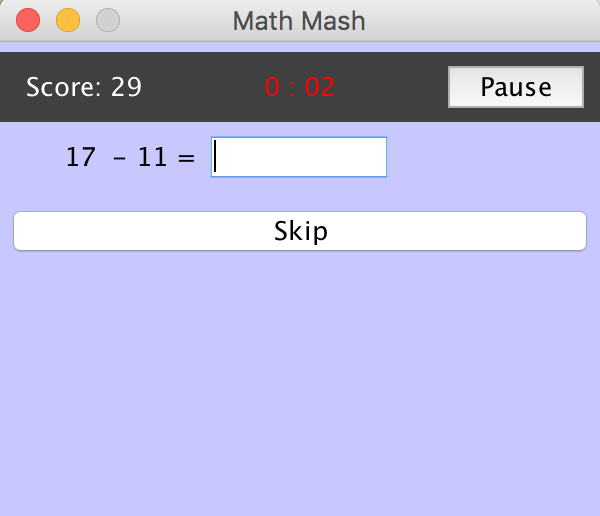
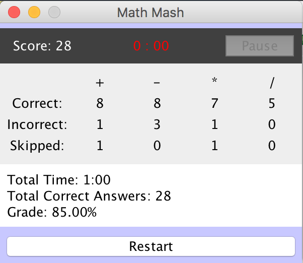

  
Math Mash Screenshots

    

      

        
        
        
      

    

### About Math Mash
Math Mash is a simple math game constructed using GUIs in the Java programming language. I was the sole developer for this project, and I came up with the game design. I built a primitive version of the game using [MIT App Inventor for Android](http://appinventor.mit.edu/explore/) during my senior year in high school. During my first semester in college, I had the opportunity to rebuild the game in my ICS 111 class as an extra credit project. I was excited to see how much I improved during the semester. Figuring out the logic and programming went very smoothly as I already had already done it once before. The most frustrating part of the process was formatting the components on the screen with Java's GUI components.

### The Game Explained
The goal of the game is to answer as many questions as possible before time runs out. Before the game begins, the user has the option to set the timer if they are not satisfied with the one minute default time. Once the user clicks the start button, the question and answer text box will appear, and the user can start answering the equations. The program creates an end less stream of randomized questions until the time runs out. As soon as the user inputs the correct answer, the next question will automatically appear. This allows for no time delay when switching between questions. If an incorrect answer remains in the text box for more than one second, the question will be considered incorrect and a label will appear to notify the user that their answer is wrong. However, the question will not change unless the user clicks the Skip button or enters the correct answer. This allows the user to acknowledge and fix their mistake. The same question will not be counted as incorrect more than once, so the user can take their time figuring out the answer. The user can also choose to skip the question if they don't know the answer or don't want to waste time on it. When the game ends, a score report is presented to the user, which displays the number of correct, incorrect, and skipped questions for each mathematical operation (+, -, *, /). The total time, total number of correct answers, and the overall grade is also displayed (see above picture). This allows the user to analyze their performance to figure out their strengths and weaknesses.

### Lessons Learned
The first time I built this game using App Inventor, I learned the basics of object oriented programming. However, since the language that I was using was a block based programming language, it was very restrictive and somewhat frustrating to work with. However, it was a lot less infuriating than working with the GUI Java components. When I rebuilt the game in Java, I was surprised by how much I improved over the course of a few months. The math operation and timer logic came naturally to me and the programming went smoothly. I also learned how to use the GUI Java components. This was the first time that I utilized them, and I have to say I did not enjoy the experience. They are extremely tedious, fragile, and just overall very tedious to deal with. Although I didn't enjoy my experience with GUI Java components, I can honestly say that I had fun working on the project as a whole. It was satisfying to see my ideas come to life. 

View the [source code](https://github.com/kathleen808/math-mash).
