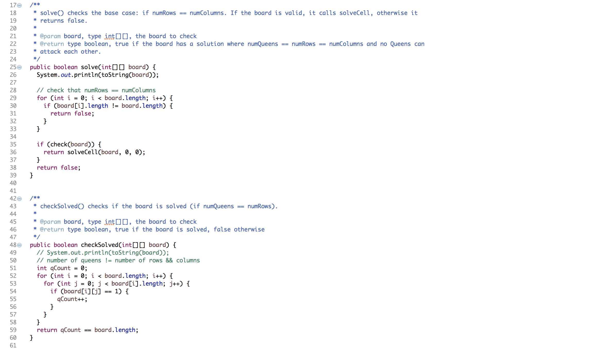
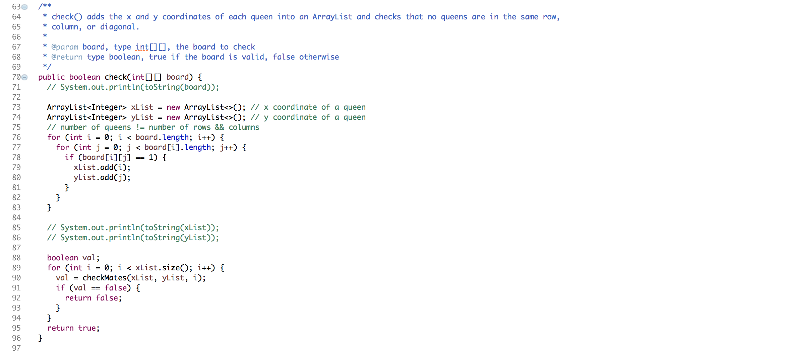
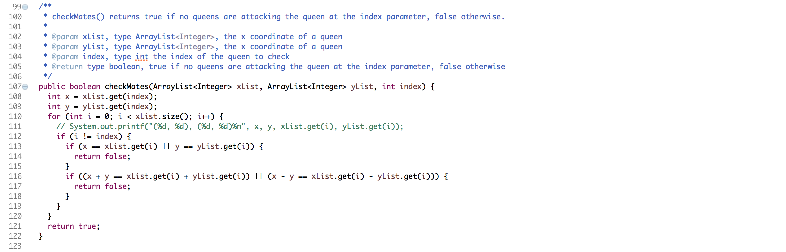
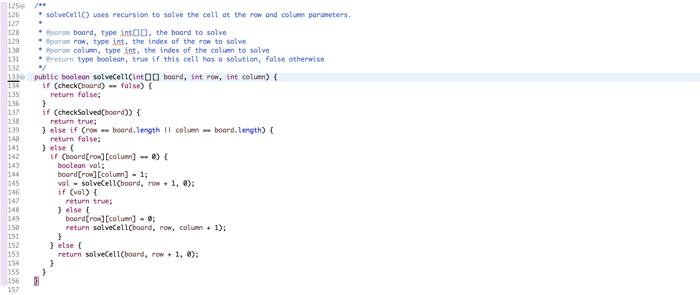

  
N-Queens Code Screenshots

    

      

        
        
        
        
      

    

### Summary
This program, written in the Java programming language, uses recursion and backtracking to solve N-Queens puzzle boards. The N-Queens problem is considered solved when there are n number of queens on a NxN board, and no queens are attacking each other. I was the main developer for this project, however, I received help from my TA, Branden Ogata. 

### Methods Explained
The program utilizes several methods with nested helper methods to efficiently solve the problem. The function recursively calls other helper methods using a brute force approach. The algorithm starts at the top left corner of the board and tests whether or not a queen can be legally placed in a particular cell. If the cell is not a valid option, the program backtracks and moves on to the next cell. 

### Lessons Learned
During this project, I gained a better understanding of recursion and backtracking. I also learned that recursion can be a very confusing concept that is difficult to visualize. However, once you understand it, it can make problem solving much easier. 

View the [source code](https://github.com/kathleen808/nqueens). 
